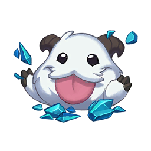

<p align="center">

</p>
<p>
    <h3 align="center">League of ASCII</h3>
    <p align="center">League of Legends CLI Artist</p>
</p>

## Getting Started

After cloning the repository with `git clone`, you can build the project using `go build .` and the executable file will be created. 

Opening your terminal and executing it, you will get the following response:
```
LeagueOfASCII - Welcome to League Of Asc II
Commands: 
- render: renderize a champion insde the terminal in format ASCII

Usage: /path/to/your/folder/leagueofascii.exe <command> --flags
```
## Commands
### Render
This command will render, by default, the champion's slpash art inside your terminal using ASCII characters. If you execute `leagueofascii[.exe] render`, you will get:
```
Render, by default, the SplashScreen of the champion
Usage of render:
  -champion string
        Name of the champion to create the ART
  -height int
        New Height
  -help
        Help about render command
  -resize
        Resize the image before rendering
  -square
        Gets the Square Asset of the Champion
  -width int
        New Width
Execution time: 518.7µs
```
For example, the following command `leagueofascii render --champion Akali` renders Akali's Splash Screen. If the image is too big, it won't fit inside your terminal. But, if you want to resize it to be smaller, you can do the following `leagueofascii render --champion Akali --resize --width 90 --height 50`

If you want to get the square of the champion, you can also do `leagueofascii render --champion Akali --resize --width 90 --height 50 --square`. It will provide you with a smaller version of the champion.
### Render Color
If you want to render the image with colors, you can use the `--color` flag. It'll render the entire image with all the colors.
## Features 
### Negative Effect
If you want to create a negative image, you could do the following below:

```go
package main

import (
	"github.com/bloiseleo/leagueofascii/leagueofascii"
	"github.com/bloiseleo/leagueofascii/leagueofascii/helpers"
)

func main() {
	img, err := helpers.ReadJpg("./assets/poro.jpg")
	if err != nil {
		panic(err)
	}
	err = leagueofascii.GenerateNegativeImage(img, "./results/poro_negated.jpg", leagueofascii.Best_Quality)
	if err != nil {
		panic(err)
	}
}
```
### Graysacle Effect
If you want some shades of gray, you could do the following below:
```go
package main

import (
	"github.com/bloiseleo/leagueofascii/leagueofascii"
	"github.com/bloiseleo/leagueofascii/leagueofascii/helpers"
)

func main() {
	img, err := helpers.ReadJpg("./assets/poro.jpg")
	if err != nil {
		panic(err)
	}
	err = leagueofascii.GrayScale(img, "./results/poro_grayscale.jpg")
	if err != nil {
		panic(err)
	}
}

```
### Image to ASCII
If you want to transform your image to an ASCII art, you could do the following below:
```go
package main

import (
	"github.com/bloiseleo/leagueofascii/leagueofascii"
	"github.com/bloiseleo/leagueofascii/leagueofascii/helpers"
)

func main() {
	img, err := helpers.ReadJpg("./assets/poro_videogame.jpeg")
	if err != nil {
		panic(err)
	}
	art := leagueofascii.CreateAscII(img)
	art.Render()
}

```
Besides, you can also resize the image and create an ASCII art.
```go
package main

import (
	"github.com/bloiseleo/leagueofascii/leagueofascii"
	"github.com/bloiseleo/leagueofascii/leagueofascii/helpers"
)

func main() {
	img, err := helpers.ReadJpg("./assets/poro_videogame.jpeg")
	if err != nil {
		panic(err)
	}
	art := leagueofascii.CreateAscIIAndResize(img, 100, 100)
	art.Render()
}
```
## Useful Links
- [What are Premultiplied Alpha colors?](https://shawnhargreaves.com/blog/premultiplied-alpha.html)
- [How to manipulate an image?](https://medium.com/@shubham0473/from-pixels-to-pictures-a-guide-to-image-manipulation-in-java-3647cac29ca3)
